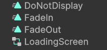
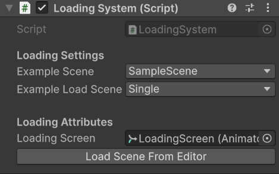

# ⏳ Loading System

## ⚙️ Fonctionnalités
- Set in editor which scene you want to load
- Set in editor which Loading mode you want
- Play loading animation in you want to load as single

## 📦 Installation

As u drag and dropped this package into your unity project, you actually made the biggest part !

If you want to use the System, drag and drop the LoadSystem Prefab in every scene's canva in your project.

In the `Animations` folder, you will three default animations and an animation controller : 

Those anims are just black fades. If you want to add yours, feel free to replace those anims by yours in the controller.

## 🔎 How to use it ?

Select the Loading System on your Hierarchy, you should see this :

The first Dropdown is for the scene you want to load

### 🚨 The scene you want to load have to be in your project settings, otherwise, the scene will not display 🚨

The other dropdown is for the loading mode.

Single = Radical scene change
Additive = You add the target scene to the current scene